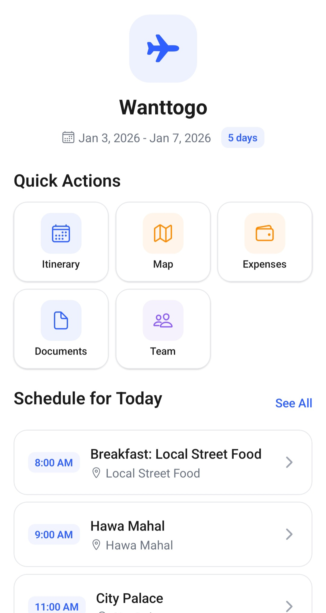
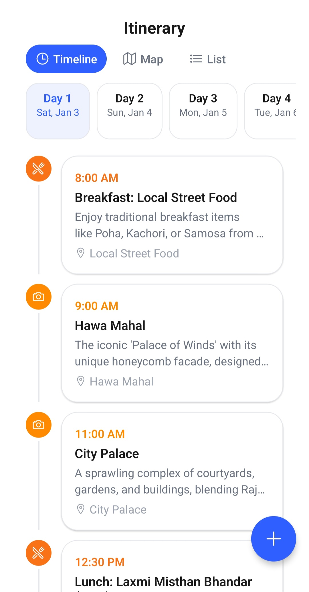
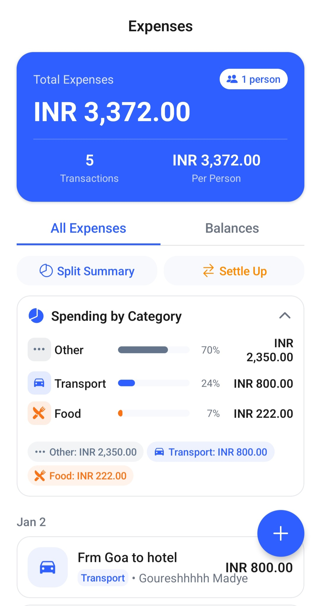
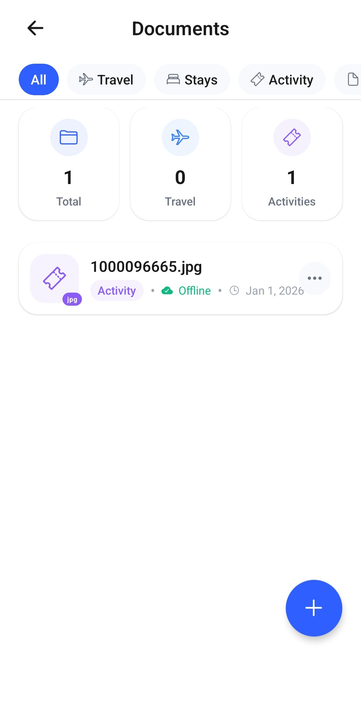
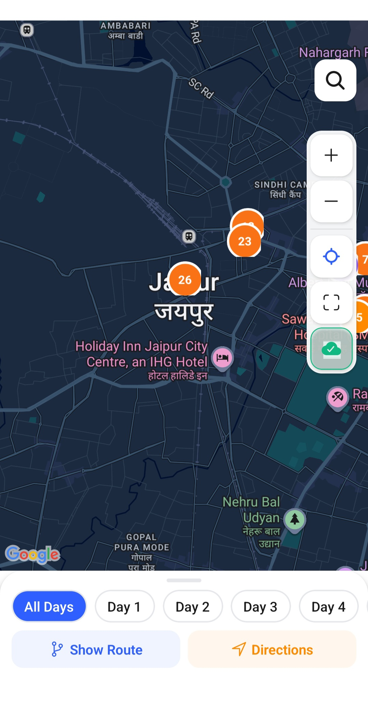
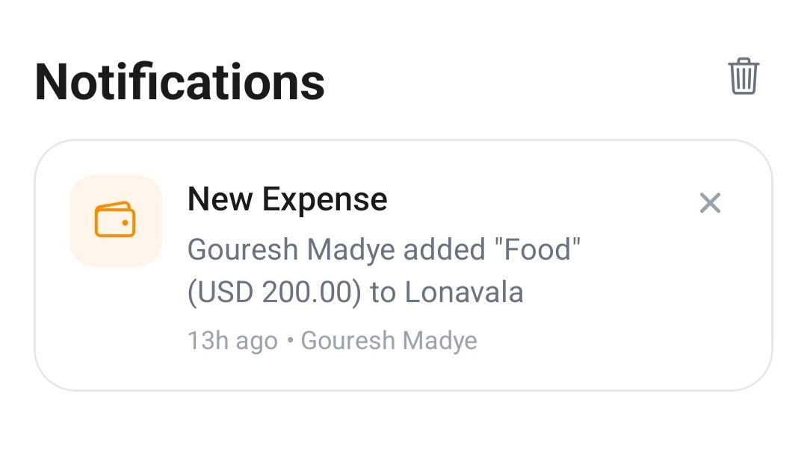
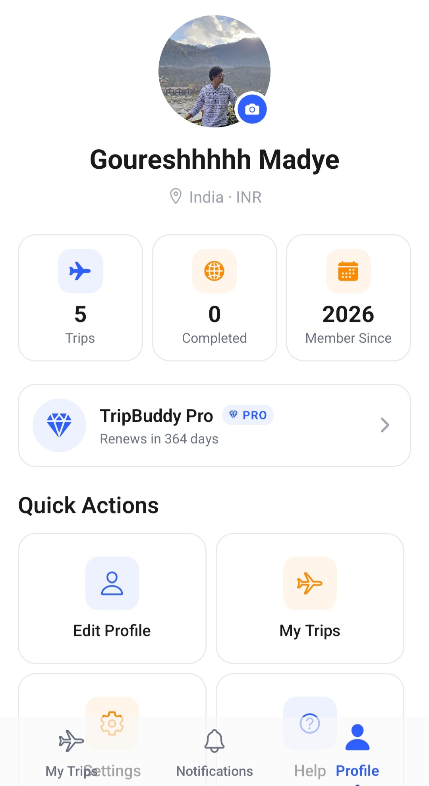
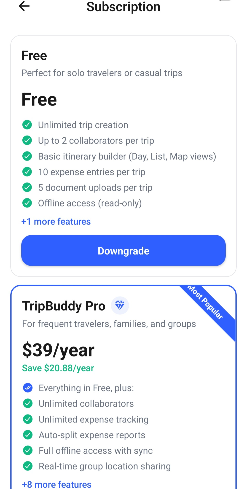
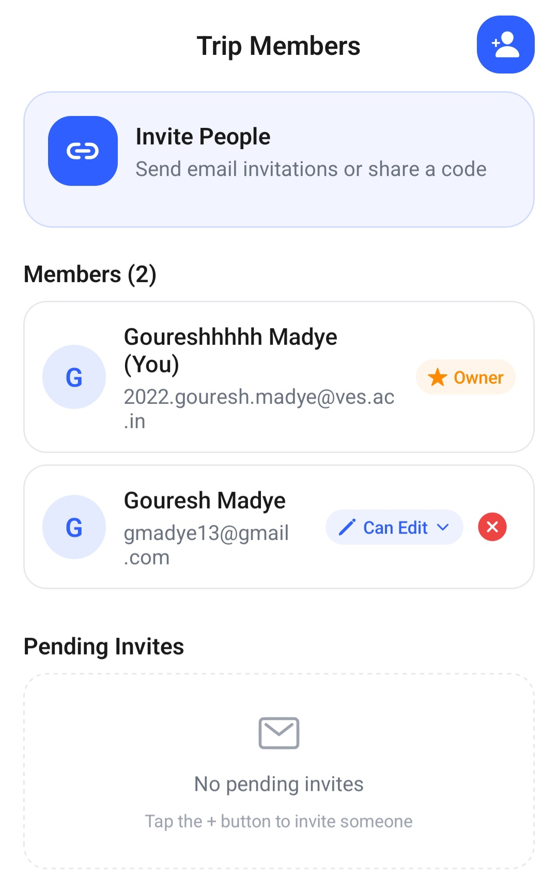

# TripBuddy

Plan trips together, travel smarter.

---

## 🚀 Overview

TripBuddy is a collaborative, mobile-first travel planning app. It centralizes itineraries, expenses, documents, and real-time collaboration—solving the chaos of spreadsheets, group chats, and scattered booking apps. Powered by AI and designed for seamless teamwork, TripBuddy is your single source of truth for solo and group adventures.

---

## ✨ Features

- **Collaborative Trip Planning:** Real-time editing, invite friends, assign roles.
- **Multiple Itinerary Views:** Timeline, Map, and List for flexible planning.
- **Expense Tracking & Auto-Split:** Log, split, and settle expenses with ease.
- **Document Upload & Offline Access:** Store tickets, IDs, and access plans offline.
- **AI-Powered Suggestions:** Get smart itinerary ideas and route optimization (Gemini/OpenAI).
- **Push Notifications:** Stay updated on trip changes and invites.
- **Subscription Plans:** Free, Pro, and Teams with feature gating and usage tracking.

---

## 🛠️ Tech Stack

- **Frontend:** React Native (Expo, TypeScript)
- **Backend:** Node.js/Express.js (planned/optional), Prisma ORM, PostgreSQL
- **Auth & Storage:** Firebase (Auth, Firestore, Storage, Messaging)
- **Maps:** Google Maps SDK & Places API
- **AI:** Gemini/OpenAI API
- **Payments:** Stripe, Google Pay

---

## 📁 Folder Structure

```
app/           # Screens & navigation
components/    # Reusable UI & logic components
hooks/         # Custom React hooks
services/      # API & business logic (auth, firestore, notifications, AI)
types/         # TypeScript types & interfaces
utils/         # Utility functions
assets/images/ # App icons, screenshots, illustrations
```

---

## 🏁 Getting Started

1. **Install dependencies:**

```sh
npm install
```

2. **Start the app:**

```sh
npx expo start --clear
```

3. **Platform-specific:**

```sh
npm run android   # Android
npm run ios       # iOS
npm run web       # Web
```

---

## 🔑 Subscription Plans & Feature Gating

| Feature           | Free Plan  | Pro ($4.99/mo)         | Teams ($99/yr)   |
| ----------------- | ---------- | ---------------------- | ---------------- |
| Collaborators     | Max 2      | Unlimited              | Up to 10 Members |
| Expenses          | 10 Entries | Unlimited + Auto-split | Unlimited        |
| Docs              | 5 Uploads  | Unlimited + Scanning   | Unlimited        |
| AI                | None       | Itinerary Suggestions  | Shared Templates |
| Offline           | Read-Only  | Full Sync              | Full Sync        |
| Team Dashboard    | No         | No                     | Yes              |
| Role-based Access | No         | No                     | Yes              |
| Priority Support  | No         | Yes                    | Yes              |

Features like auto-split, AI suggestions, unlimited uploads, and advanced exports are gated by plan. Upgrade in-app for more power.

---

## 🤖 AI Integration

- **Gemini/OpenAI:** Get smart itinerary suggestions, route optimization, and travel highlights.

---

## 🌐 Offline Support

- Access itineraries, documents, and maps in read-only mode when offline.

---

## 🖼️ Screenshots

Below are screenshots of the main app screens (Version 01):

<div align="center">
  
  
  
  
</div>

<div align="center">
  
  
  
  
  
</div>

---

## 1\. Executive Summary

TripBuddy is a mobile-first application designed to streamline travel planning. It solves the fragmentation problem of using spreadsheets, group chats, and disparate booking apps. By centralizing itineraries, expenses, documents, and real-time collaboration, TripBuddy acts as a single source of truth for solo travelers and groups.

**2\. Functional Specifications (MVP)**

### 2.1. Authentication & Onboarding

- **Methods:** Email/Password, Google OAuth (via Firebase).
- **Profile Setup:** Name, Profile Photo, Default Currency (USD default), Home Country.
- **Intro Walkthrough:** Carousel highlighting visual planning, expense splitting, and offline capabilities.

### 2.2. Trip Management

- **Creation:** Users can create trips with a Title, Dates, Transportation Mode, and Trip Type (Leisure, Business, Adventure).
- **Dashboard:** "My Trips" view showing upcoming, past, and drafted trips.

### 2.3. Collaborative Itinerary

- **Views:**
  - **Timeline:** Chronological list of activities.
  - **Map:** Geospatial view of daily pins.
  - **List:** Compact view.
- **Item Details:** Title, Location (Lat/Long), Time, Notes, Tags.
- **Collaboration:** Real-time editing by "Editors." Comments on specific itinerary items.

### 2.4. Expense Tracking & Splitting

- **Entry:** Record expenses with Amount, Payer, and Beneficiaries (who the cost is split with).
- **Settlement:** Calculate "Who owes whom."
- **Payment:** Integration with Google Pay/UPI for settling debts.

### 2.5. Documents & Offline Mode

- **Storage:** Upload tickets, hotel vouchers, and IDs.
- **Offline Sync:** Read-only access to itinerary and documents when no internet is available.

## 3\. System Architecture

### 3.1. Tech Stack

- **Frontend:** React Native (Cross-platform Mobile).
- **Backend:** Node.js / Express.js.
- **Database:** Firestore Database.
- **Auth & Storage:** Google Firebase.
- **Infrastructure:** Google Cloud Platform.

### 3.2. External Integrations

| Service                      | Purpose                                                  |
| ---------------------------- | -------------------------------------------------------- |
| Google Maps SDK & Places API | Rendering maps, autocomplete search, routing.            |
| RazorPay                     | Payment settlements and subscription processing.         |
| Gemini API                   | AI-powered itinerary suggestions and route optimization. |
| Firebase Cloud Messaging     | Real-time push notifications.                            |
| Nylas / MailboxLayer         | Email parsing for auto-importing bookings.               |

##

## 4\. Data Model (Firestore Database)

The database is designed for relational integrity, linking users to trips via a many-to-many relationship (collaborators).

### 4.1. Core Tables

\-- Users Table  
CREATE TABLE users (  
id UUID PRIMARY KEY,  
name TEXT NOT NULL,  
email TEXT UNIQUE NOT NULL,  
profile_photo TEXT,  
default_currency TEXT DEFAULT 'USD',  
created_at TIMESTAMP DEFAULT NOW()  
);

\-- Trips Table  
CREATE TABLE trips (  
id UUID PRIMARY KEY,  
title TEXT NOT NULL,  
start_date DATE NOT NULL,  
end_date DATE NOT NULL,  
creator_id UUID REFERENCES users(id),  
transportation_mode TEXT,  
trip_type TEXT,  
created_at TIMESTAMP DEFAULT NOW()  
);

\-- Trip Collaborators (Junction Table)  
CREATE TABLE trip_collaborators (  
id UUID PRIMARY KEY,  
trip_id UUID REFERENCES trips(id),  
user_id UUID REFERENCES users(id),  
role TEXT DEFAULT 'editor' -- values: viewer, editor, owner  
);

### 4.2. Itinerary & Logistics

\-- Itinerary Items  
CREATE TABLE itinerary_items (  
id UUID PRIMARY KEY,  
trip_id UUID REFERENCES trips(id),  
title TEXT NOT NULL,  
description TEXT,  
location TEXT,  
latitude DOUBLE PRECISION,  
longitude DOUBLE PRECISION,  
category TEXT,  
start_time TIMESTAMP,  
end_time TIMESTAMP,  
added_by UUID REFERENCES users(id),  
created_at TIMESTAMP DEFAULT NOW()  
);

\-- Location Sharing  
CREATE TABLE user_locations (  
user_id UUID REFERENCES users(id),  
trip_id UUID REFERENCES trips(id),  
latitude DOUBLE PRECISION,  
longitude DOUBLE PRECISION,  
last_updated TIMESTAMP DEFAULT NOW(),  
PRIMARY KEY(user_id, trip_id)  
);

Technical Note on Location:

**4.3. Financials & Assets**

\-- Expenses  
CREATE TABLE expenses (  
id UUID PRIMARY KEY,  
trip_id UUID REFERENCES trips(id),  
title TEXT NOT NULL,  
amount DECIMAL(10, 2) NOT NULL,  
currency TEXT DEFAULT 'USD',  
paid_by UUID REFERENCES users(id),  
created_at TIMESTAMP DEFAULT NOW()  
);

\-- Expense Shares (Split Logic)  
CREATE TABLE expense_shares (  
id UUID PRIMARY KEY,  
expense_id UUID REFERENCES expenses(id),  
user_id UUID REFERENCES users(id),  
share_amount DECIMAL(10, 2) NOT NULL  
);

\-- Documents  
CREATE TABLE documents (  
id UUID PRIMARY KEY,  
trip_id UUID REFERENCES trips(id),  
uploaded_by UUID REFERENCES users(id),  
file_url TEXT NOT NULL, -- Link to Firebase Storage  
label TEXT,  
type TEXT, -- flight, hotel, activity  
created_at TIMESTAMP DEFAULT NOW()  
);

## 5\. API Specification

The backend will expose RESTful endpoints.

### Auth & User

- POST /auth/signup & POST /auth/login
- POST /auth/google (OAuth Handler)
- GET /user/profile & PUT /user/profile

### Trips & Collaboration

- POST /trips (Create Trip)
- GET /trips/:tripId (Get Trip Details)
- POST /trips/:tripId/invite (Add Collaborator)
- PUT /trips/:tripId/collaborators/:userId (Update Role)

### Itinerary

- GET /trips/:tripId/itinerary (Fetch all items)
- POST /trips/:tripId/itinerary (Add item)
- PUT /itinerary/:itemId (Update time/location)
- POST /itinerary/:itemId/comments (Add comment)

### Expenses

- POST /trips/:tripId/expenses (Log expense)
- GET /expenses/:tripId/summary (Returns total spend + who owes whom calculations)

### Sync & Data

- GET /trips/:tripId/export (JSON payload for local storage/offline mode)
- POST /trips/:tripId/documents (Upload metadata for stored files)

## 6\. UI/UX Wireframe Guidelines

1.  **Splash & Onboarding:** Clean, high-quality travel imagery. Quick account creation to minimize friction.
2.  **Dashboard:** Card-based layout. "Create Trip" should be a sticky action button (FAB).
3.  **Itinerary View:**
    - **Header:** Dynamic map snippet at the top.
    - **Body:** Scrollable timeline. Each item is a clickable card expanding to show notes and attachments.
4.  **Expense Tab:** Visual bar chart of spending vs. budget. List of recent transactions below.
5.  **Map Screen:** Full-screen Google Maps integration. Pins color-coded by "Day" or "Category" (Food vs. Travel).

## 7\. Monetization Strategy

TripBuddy operates on a Freemium SaaS model.

| Feature  | Free Plan   | Pro ($4.99/mo)         | Teams ($99/yr)       |
| -------- | ----------- | ---------------------- | -------------------- |
| Collab   | Max 2 Users | Unlimited              | Up to 10 Members     |
| Expenses | 10 Entries  | Unlimited + Auto-split | Unlimited            |
| Docs     | 5 Uploads   | Unlimited + Scanning   | Unlimited            |
| AI       | None        | Itinerary Suggestions  | Shared Templates     |
| Offline  | Read-Only   | Full Sync              | Full Sync            |
| Target   | Solo/Casual | Families/Power Users   | Agencies/Tour Groups |

## 8\. Development Roadmap

### Phase 1: Foundation (Weeks 1-4)

### Phase 2: Core Experience (Weeks 5-8)

### Phase 3: Utility Features (Weeks 9-12)

### Phase 4: Polish & Pro (Weeks 13-16)

## Version 01 of Final Product

### UI Screenshots

Below are screenshots of the main app screens (Version 01):

<div align="center">
  
  
  
  
</div>

<div align="center">
  
  
  
  
  
</div>

---
